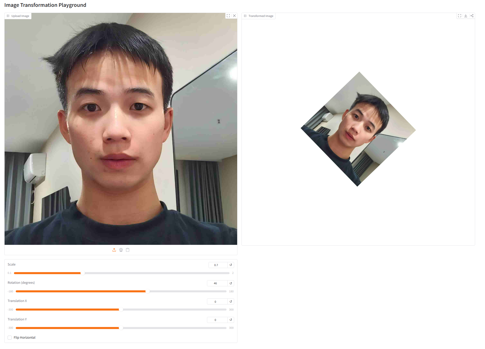
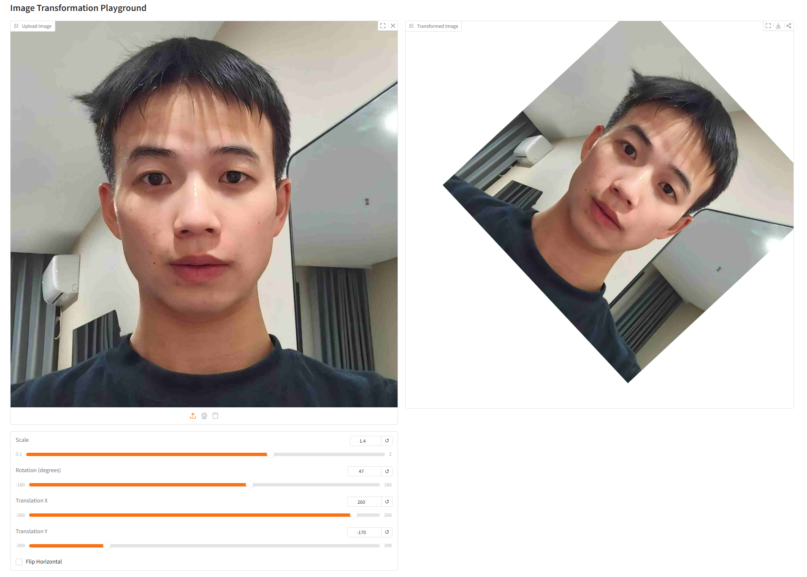
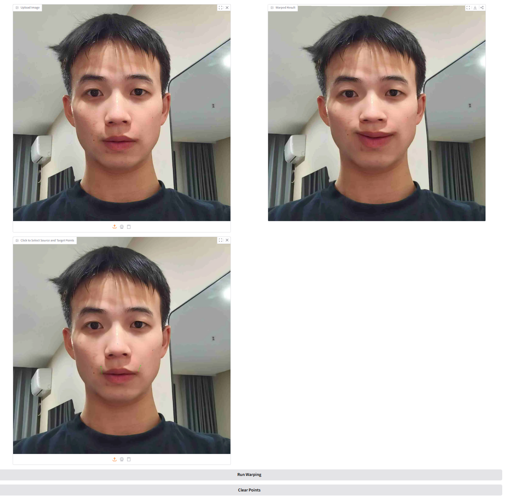

# Assignment 1 - Image Warping

This repository is my implementation of Assignment 1 for Digital Image Processing. The work includes basic geometric transformation and point-guided image deformation with an interactive Gradio interface.


## Requirements

Install the required packages with:

```setup
python -m pip install -r requirements.txt
```

## Running

Run the global transformation demo:

```basic
python run_global_transform.py
```

Run the point-guided deformation demo:

```point
python run_point_transform.py
```

## Work Summary

### 1. Basic Image Geometric Transformation

In `run_global_transform.py`, I implemented:

- scaling, rotation, translation, and horizontal flipping
- affine matrix composition in homogeneous coordinates
- center-based scaling and rotation
- manual inverse mapping and bilinear interpolation without calling existing geometric transform APIs

### 2. Point Guided Image Deformation

In `run_point_transform.py`, I implemented:

- point pair selection through the Gradio interface
- MLS affine deformation based on control points
- backward warping from target pixels to source pixels
- bilinear interpolation for smooth deformation results

## Results

### Basic Transformation

`global_1.png` shows image scaling and rotation.



`global_2.png` shows image translation.



### Point Guided Deformation

`point_1.png` shows the eyes moved outward and downward.


`point_2.png` shows the mouth corners lifted upward.



## Conclusion

This assignment completes both global image transformation and local point-guided deformation. The global module supports combined affine operations, and the point-guided module produces natural local edits such as eye movement and mouth lifting.

## References

- Teaching slides: [作业01-ImageWarping.pptx](references/%E4%BD%9C%E4%B8%9A01-ImageWarping.pptx)
- Schaefer, McPhail, Warren. [Image Deformation Using Moving Least Squares](references/mls.pdf)
