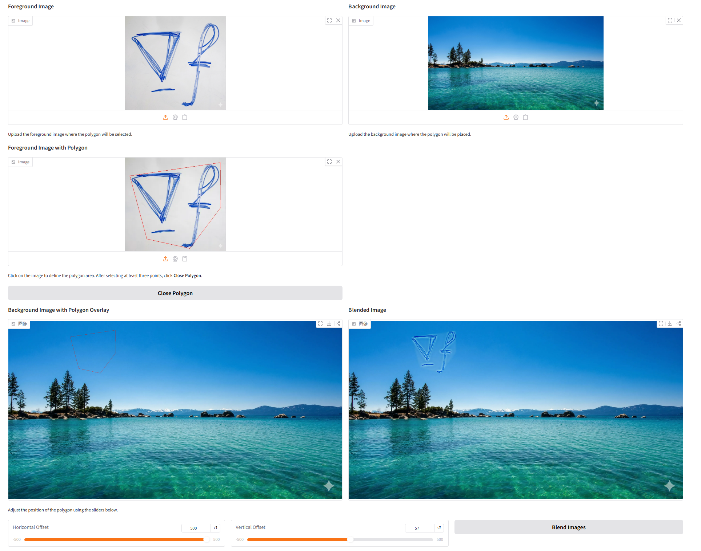
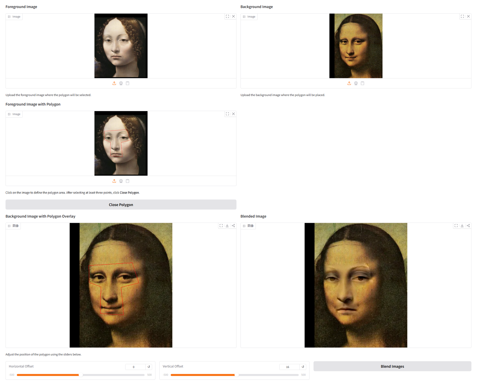
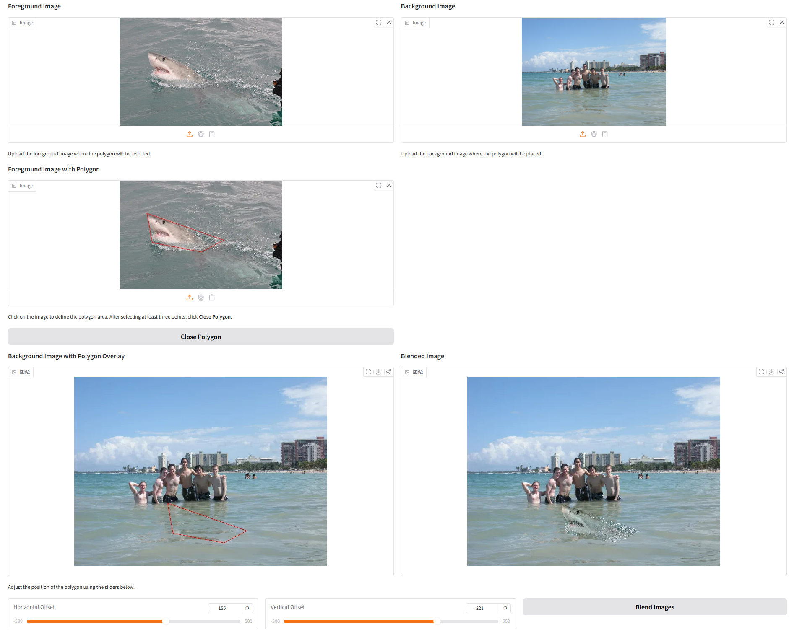
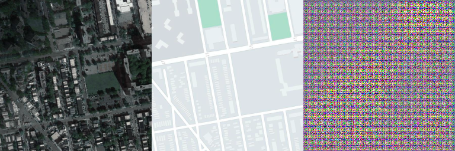
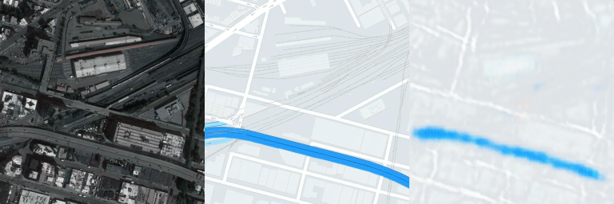
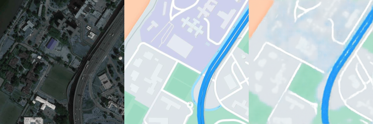
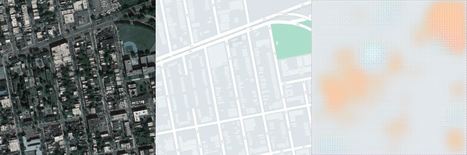
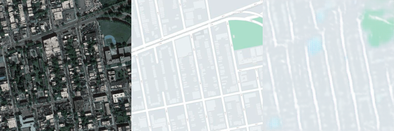
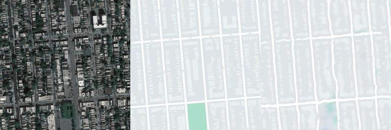

# Assignment 02 Report: DIP with PyTorch

## 1. 作业目标

本次作业包含两部分：

1. 使用 PyTorch 实现传统数字图像处理任务 `Poisson Image Editing`。
2. 使用 PyTorch 实现基于全卷积网络的图像到图像映射任务 `Pix2Pix-style Image Translation`。

这次作业的重点不是直接调用现成算法，而是用 PyTorch 的张量、卷积与优化机制，分别完成一个传统优化问题和一个深度学习问题，从而把“数据处理 -> 模型/目标函数构建 -> 优化/训练 -> 结果分析”这一整套流程走通。

---

## 2. 实验环境

- OS / 运行环境：Linux 服务器
- 深度学习框架：PyTorch
- 交互界面：Gradio
- 其他依赖：NumPy、Pillow、OpenCV
- 训练显卡：NVIDIA GeForce RTX 5090

---

## 3. Part I: Poisson Image Editing

### 3.1 任务原理

Poisson Image Editing 的目标是将前景图像中的一块区域粘贴到背景图像中，同时尽量避免直接拷贝像素带来的明显边界。  
它的核心思想不是“直接复制颜色”，而是“保持源图像区域内部的梯度结构”，并让融合后的结果在边界处与目标图像自然衔接。

如果把结果图记为 $f$，源图像记为 $g$，目标是让结果区域的梯度尽量接近源图像梯度：

$$
\min_f \int_\Omega |\nabla f - \nabla g|^2
$$

在离散图像上，梯度约束通常可以转化为拉普拉斯约束，因此本作业中我使用了基于拉普拉斯卷积的损失函数来完成优化。

### 3.2 我完成的实现内容

我在 [run_blending_gradio.py](./run_blending_gradio.py) 中补全了以下关键部分：

1. `create_mask_from_points()`  
   将用户在前景图上点击得到的多边形顶点转为二值 mask，其中多边形内部为 255，外部为 0。

2. `cal_laplacian_loss()`  
   使用 `torch.nn.functional.conv2d` 对前景图与待优化融合图进行拉普拉斯卷积，并仅在选定 mask 区域上计算 L1 损失。

3. 图像通道兼容处理  
   部分测试图像为 `RGBA`，我在进入优化前将图像统一转换为 `RGB`，避免通道数不匹配。

4. 交互式融合流程  
   通过 Gradio 完成“上传前景/背景图 -> 勾选多边形区域 -> 设置偏移量 -> 开始优化”的完整可视化流程。

### 3.3 优化流程

Poisson 部分的实际处理流程如下：

1. 在前景图中手工点击多边形顶点，圈定需要融合的区域。
2. 将多边形转换为前景 mask。
3. 根据滑块偏移量把前景区域映射到背景图中，得到背景 mask。
4. 将背景图中的待融合区域作为可学习变量 `blended_img`。
5. 用 Adam 优化器最小化前景拉普拉斯与融合图拉普拉斯之间的差异。
6. 迭代 5000 步，并在训练中途降低学习率。

### 3.4 Poisson 实验结果

本次共完成了三组案例实验：

- `equation`
- `monolisa`
- `water`

#### 3.4.1 Case 1: equation

训练日志显示拉普拉斯损失从 `0.07745` 下降到 `0.000885`，约降到初始值的 `1.14%`。

#### 3.4.2 Case 2: monolisa

训练日志显示拉普拉斯损失从 `0.04352` 下降到 `0.001066`，约降到初始值的 `2.45%`。

#### 3.4.3 Case 3: water

训练日志显示拉普拉斯损失从 `0.20740` 下降到 `0.000848`，约降到初始值的 `0.41%`。

### 3.5 Poisson 结果分析

从三组实验结果可以看到：

1. 损失都明显下降，说明基于拉普拉斯约束的优化确实在稳定收敛。
2. `monolisa` 案例中，人脸区域融合到背景后边界过渡较自然，说明该方法能够较好保持局部结构。
3. `water` 案例中，鲨鱼区域融合到海面后能较好融入背景纹理，说明该方法对颜色和亮度的局部调整是有效的。
4. `equation` 案例中，前景与背景尺度差异较大，虽然整体完成了融合，但也能看出大范围粘贴时对选区和位置更敏感。

总体来看，Poisson 编辑相比直接复制粘贴，边缘过渡明显更自然，这是梯度域融合方法的主要优势。

---

## 4. Part II: Pix2Pix-style Image Translation

### 4.1 任务理解

这一部分的目标是使用成对数据训练一个图像到图像映射网络。  
输入一张图像，网络输出与之对应的目标图像。老师提供的代码并没有加入完整 GAN 中的判别器，而是要求先实现一个以 FCN 为核心的生成网络，用监督学习的方式完成图像翻译任务。

本次实验中我使用的是 `maps` 数据集。该数据集的每张样本图由左右两部分拼接而成，一半作为输入，另一半作为监督目标。  
在实际结果图中，左图是输入，中图是真实目标，右图是模型输出。

### 4.2 数据集与预处理

数据集：`pix2pix maps`

- 训练集样本数：`1096`
- 验证集样本数：`1098`

为了让网络结构稳定工作，我在 [Pix2Pix/facades_dataset.py](./Pix2Pix/facades_dataset.py) 中做了如下处理：

1. 读入拼接图像。
2. 按左右两半切分为输入图和目标图。
3. 将 BGR 转换为 RGB。
4. 将两半图像统一缩放到 `256 x 256`。
5. 将像素值归一化到 `[-1, 1]`。

### 4.3 网络结构

我在 [Pix2Pix/FCN_network.py](./Pix2Pix/FCN_network.py) 中实现了一个编码器-解码器式全卷积网络：

- 编码器：4 层卷积下采样
- 解码器：4 层转置卷积上采样
- 激活函数：编码器使用 `LeakyReLU`，解码器使用 `ReLU`
- 输出层使用 `Tanh`

网络的整体通道变化为：

`3 -> 64 -> 128 -> 256 -> 512 -> 256 -> 128 -> 64 -> 3`

该网络符合 FCN 的基本思想：全程使用卷积/反卷积层，不使用全连接层，因此可以直接处理二维图像张量。

### 4.4 训练设置

训练代码位于 [Pix2Pix/train.py](./Pix2Pix/train.py)。

本次实验使用的主要设置如下：

- 数据集：`maps`
- 输入分辨率：`256 x 256`
- 损失函数：`L1 Loss`
- 优化器：`Adam`
- 学习率：`0.001`
- `betas=(0.5, 0.999)`
- batch size：`8`
- 训练轮数：`200`
- 学习率调度：`StepLR(step_size=120, gamma=0.2)`
- checkpoint 保存轮数：`1, 50, 100, 150, 200`
- 可视化结果保存频率：每 `5` 个 epoch 保存一次 train/val 结果

### 4.5 Pix2Pix 训练结果展示

#### 4.5.1 训练集结果

从训练集中抽取同一样本，对比 `epoch 0`、`epoch 50` 与 `epoch 195` 的输出：

**Epoch 0**

**Epoch 50**

**Epoch 195**

可以看到：

1. 在 `epoch 0` 时，输出几乎只是模糊的颜色块。
2. 到 `epoch 50` 时，已经能够恢复较明显的道路、河流和地块分布。
3. 到 `epoch 195` 时，蓝色河流、白色道路和绿色区域的布局已经和目标图接近，说明模型已经学到较稳定的映射关系。

#### 4.5.2 验证集结果

验证集上同样观察 `epoch 0`、`epoch 50` 与 `epoch 195`：

**Epoch 0**

**Epoch 50**

**Epoch 195**

验证集现象与训练集类似：

1. 初始阶段输出模糊，几乎不具备真实结构。
2. 随着训练推进，道路网格和大色块区域逐渐被学出来。
3. 到后期验证图中，模型可以生成与目标图拓扑关系较接近的结构，说明使用比 `facades` 更大的 `maps` 数据集后，验证集上也具备一定泛化能力。

### 4.6 Pix2Pix 结果分析

本次实验中最明显的现象有以下几点：

1. 模型先学习颜色与大块区域分布，再逐渐学习道路、河流等结构信息。
2. 训练后期输出比前期更稳定，说明 FCN 结构已经能够在监督信号下学习到输入图与目标图之间的空间对应关系。
3. 验证集结果相比训练集略模糊，细节也更弱，这说明模型仍然存在一定泛化差距，但已经能生成基本合理的地图风格结果。
4. 与 `facades` 相比，`maps` 数据量更大，更符合老师“使用更多样本并在验证集上取得较好效果”的要求。

需要说明的是，本作业实现的是一个 **FCN + L1 Loss** 的简化版 Pix2Pix 训练流程，并未加入完整条件 GAN 中的判别器，因此最终结果更偏平滑，纹理细节不如完整 Pix2Pix 模型锐利，但作为课程作业，已经较完整地体现了图像到图像翻译任务的数据处理、网络搭建与训练过程。

---

## 5. 本次作业中完成的主要工作

### 5.1 传统 DIP 部分

- 完成多边形选区转 mask
- 完成拉普拉斯损失计算
- 使用 PyTorch 优化融合图像
- 搭建并运行 Gradio 交互界面
- 完成三组 Poisson 融合实验并保存日志与截图

### 5.2 深度学习 DIP 部分

- 完成 FCN 编码器-解码器网络
- 实现成对图像的读取、切分与缩放
- 补充了可配置训练参数
- 新增 `prepare_dataset.py` 生成 `train_list.txt` 与 `val_list.txt`
- 在 `maps` 数据集上完成 200 epoch 训练
- 保存 train/val 可视化结果与模型 checkpoint

---

## 6. 总结

通过本次作业，我分别用 PyTorch 完成了一个传统优化问题和一个深度学习问题。

在 Poisson Image Editing 部分，我理解并实现了梯度域融合的核心思想：不直接复制像素，而是在目标区域内通过优化保持源图像的梯度结构，并与背景边界自然衔接。实验结果表明，这种方法确实能带来比直接粘贴更自然的视觉效果。

在 Pix2Pix-style 图像翻译部分，我完成了从数据准备、数据集读取、全卷积网络搭建到模型训练和验证分析的完整流程。使用 `maps` 数据集后，模型在验证集上也能生成结构较合理的目标图像，说明训练过程是有效的，也达到了本次作业要求的目标。

总体来说，这次作业帮助我把 PyTorch 从“张量库”进一步理解为“既能做传统优化、也能做深度学习建模”的统一工具。

---

## 7. 参考文献

1. Perez, P., Gangnet, M., Blake, A. *Poisson Image Editing*. ACM SIGGRAPH, 2003.  
   [https://www.cs.jhu.edu/~misha/Fall07/Papers/Perez03.pdf](https://www.cs.jhu.edu/~misha/Fall07/Papers/Perez03.pdf)

2. Isola, P., Zhu, J.-Y., Zhou, T., Efros, A. A. *Image-to-Image Translation with Conditional Adversarial Nets*. CVPR, 2017.  
   [https://phillipi.github.io/pix2pix/](https://phillipi.github.io/pix2pix/)

3. Long, J., Shelhamer, E., Darrell, T. *Fully Convolutional Networks for Semantic Segmentation*. CVPR, 2015.  
   [https://arxiv.org/abs/1411.4038](https://arxiv.org/abs/1411.4038)

4. PyTorch Documentation  
   [https://pytorch.org/](https://pytorch.org/)
