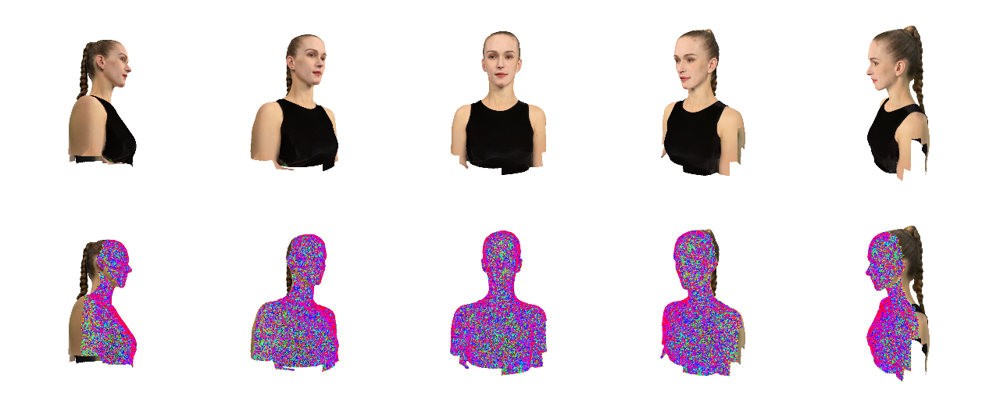
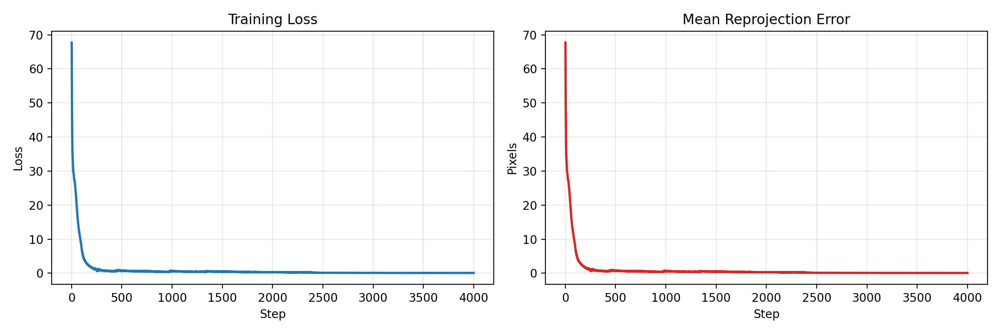
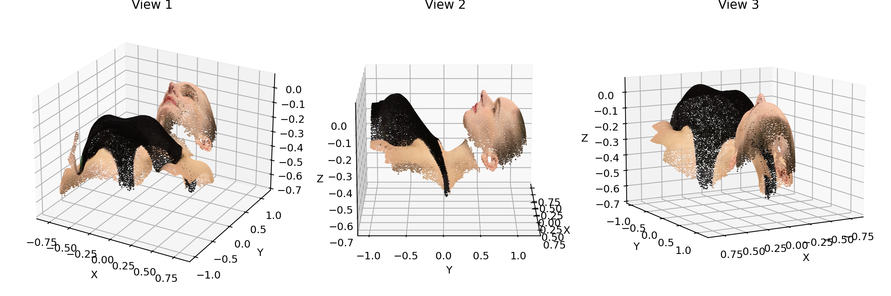
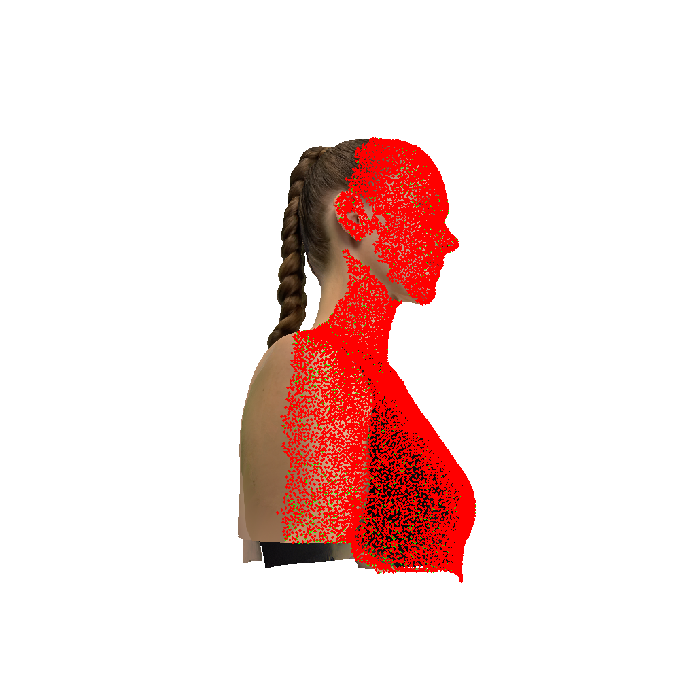
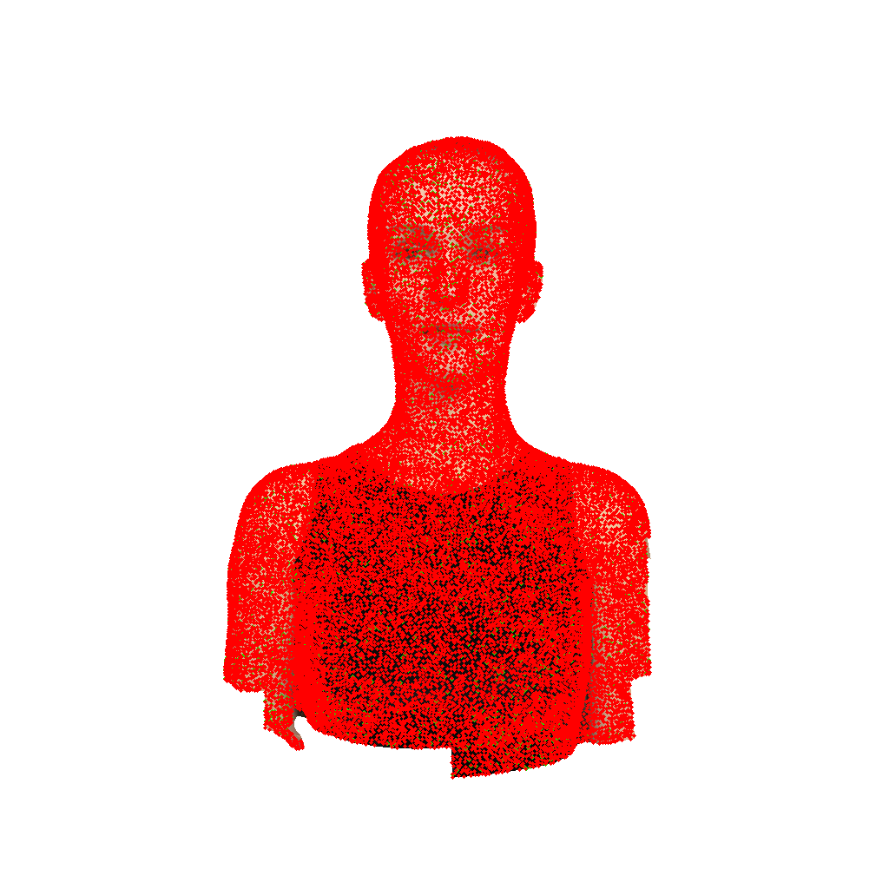
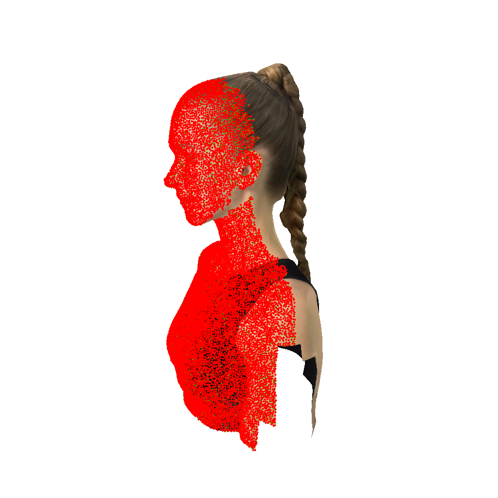

# Assignment 03 - Bundle Adjustment

本次作业包含两个部分：

1. 使用 PyTorch 从 2D 多视角观测中优化恢复相机参数、焦距和 3D 点云。
2. 使用 COLMAP 对 50 张多视角渲染图像进行三维重建。

---

## 数据说明

作业提供的数据位于 `data/` 目录：

```text
data/
├── images/              # 50 张渲染视角图像，分辨率为 1024 x 1024
├── points2d.npz         # 2D 观测点，包含 view_000 到 view_049
└── points3d_colors.npy  # 每个 3D 点对应的 RGB 颜色
```

其中 `points2d.npz` 中每个视角的数据形状为 `(20000, 3)`，每一行表示：

```text
(x, y, visibility)
```

`x, y` 为该 3D 点在当前视角下的像素坐标，`visibility` 表示该点是否在当前视角可见。图像尺寸为 `1024 x 1024`，共有 `50` 个视角和 `20000` 个待恢复的 3D 点。

数据可视化如下：



---

## Task 1: PyTorch 实现 Bundle Adjustment

### 方法概述

本部分使用 PyTorch 从 2D 观测直接优化 Bundle Adjustment 问题。需要恢复的未知量包括：

- 共享相机焦距 `f`
- 每个视角的相机外参 `R, T`
- 所有 3D 点坐标 `X, Y, Z`

相机坐标变换定义为：

```text
[Xc, Yc, Zc]^T = R @ [X, Y, Z]^T + T
```

投影公式为：

```text
u = -f * Xc / Zc + cx
v =  f * Yc / Zc + cy
```

其中 `cx = image_width / 2`，`cy = image_height / 2`。由于物体位于相机前方时在该坐标设定下有 `Zc < 0`，因此 `u` 方向使用负号以保证左右方向不翻转。

旋转矩阵使用 Euler 角参数化，优化目标为可见点上的重投影误差：

```text
L = mean(|| projected_2d - observed_2d ||)
```

为了提高优化稳定性，实现中还加入了轻量的点云正则项、平移正则项、焦距正则项和深度约束项。优化器使用 Adam。

主要代码文件：

```text
bundle_adjustment.py        # BA 模型、投影函数、Euler 角旋转、OBJ 导出
train_bundle_adjustment.py  # 训练入口、结果保存和可视化
run_bundle_adjustment.sh    # Linux 服务器运行脚本
```

### 初始化策略

初始化时将焦距设置为 `900`，相机距离设置为 `2.5`。所有视角的相机大致位于物体正前方，平移初始化在 `[tx, ty, -d]` 附近。3D 点坐标根据多视角 2D 观测的中心位置进行反投影估计，并加入少量随机扰动。

坐标系示意图如下：


### 运行方式

在服务器上运行：

```bash
python train_bundle_adjustment.py \
  --data-dir data \
  --output-dir outputs/bundle_adjustment \
  --device cuda \
  --steps 4000 \
  --lr 1e-2
```

输出结果位于：

```text
outputs/bundle_adjustment/
```

### 优化结果

本次实验共优化 `4000` 步，最终结果如下：

| 指标 | 数值 |
|---|---:|
| Optimization steps | 4000 |
| Estimated focal length | 900.0823 |
| Mean reprojection error | 0.0897 px |
| Median reprojection error | 0.0615 px |
| Final total loss | 0.089785 |

可以看到，优化后的平均重投影误差低于 `0.1 px`，说明恢复出的相机参数和 3D 点云能够很好地解释输入的 2D 观测。

Loss 和重投影误差曲线如下：



最终恢复的彩色 3D 点云多视角可视化如下：



### 重投影可视化

下图展示了部分视角的重投影结果。绿色点表示输入 2D 观测，红色点表示优化后的 3D 点重新投影到图像平面的位置。两者基本重合，说明 Bundle Adjustment 优化结果较好。







---

## Task 2: 使用 COLMAP 进行三维重建

### 方法概述

本部分使用 COLMAP 对 `data/images/` 中的 50 张多视角图像进行三维重建。流程包括：

1. Feature Extraction：提取 SIFT 特征。
2. Feature Matching：进行 exhaustive matching。
3. Sparse Reconstruction：使用 COLMAP mapper 估计相机位姿和稀疏点云。
4. Image Undistortion：将稀疏模型转换为 dense workspace。
5. Patch Match Stereo / Stereo Fusion：用于生成稠密点云。

本次实验提供了 Python 入口脚本，避免手动逐条执行 COLMAP 命令：

```text
run_colmap.py
```

### 运行方式

服务器上运行：

```bash
python run_colmap.py --data-dir data --gpu-index 0 --sift-use-gpu 0
```

其中 `--sift-use-gpu 0` 表示 SIFT 特征提取和匹配使用 CPU，避免无图形界面服务器中 COLMAP 的 OpenGL/SIFT GPU 后端报错；后续 dense 阶段仍使用 GPU 选项。

如果只需要运行到稀疏重建阶段，可使用：

```bash
python run_colmap.py --data-dir data --gpu-index 0 --sift-use-gpu 0 --skip-dense
```

### COLMAP 重建结果

COLMAP 稀疏重建结果保存在：

```text
data/colmap/sparse/0/
├── cameras.bin
├── images.bin
├── points3D.bin
└── project.ini
```

这些文件分别保存了相机内参、图像位姿、稀疏三维点以及工程配置。该阶段完成了特征提取、特征匹配、相机位姿估计以及 COLMAP 内部的 Bundle Adjustment。

同时，COLMAP 的 dense workspace 已生成在：

```text
data/colmap/dense/
├── images/
├── sparse/
└── stereo/
```

其中 `images/` 为去畸变后的图像，`sparse/` 为转换后的稀疏模型，`stereo/` 为 PatchMatch Stereo 和 Stereo Fusion 使用的配置目录。

---

## 结果文件汇总

Task 1 主要输出：

```text
outputs/bundle_adjustment/loss_curve.png
outputs/bundle_adjustment/point_cloud_views.png
outputs/bundle_adjustment/summary.txt
outputs/bundle_adjustment/view_000_overlay.png
outputs/bundle_adjustment/view_025_overlay.png
outputs/bundle_adjustment/view_049_overlay.png
```

Task 2 主要输出：

```text
data/colmap/database.db
data/colmap/sparse/0/
data/colmap/dense/
```

---

## 总结

本次作业中，我首先使用 PyTorch 从零实现了 Bundle Adjustment，通过优化共享焦距、50 组相机外参和 20000 个 3D 点坐标，使最终平均重投影误差达到 `0.0897 px`。实验结果表明，优化得到的 3D 点云具有清晰的头部形状，且重投影点与输入观测高度一致。

随后，我使用 COLMAP 对多视角图像进行三维重建，完成了特征提取、特征匹配、稀疏重建和 dense workspace 构建。COLMAP 输出的相机模型、图像位姿和三维点云结果可用于进一步查看、渲染和分析。
