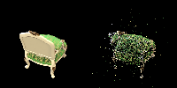
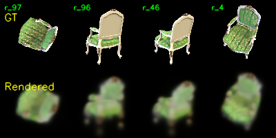
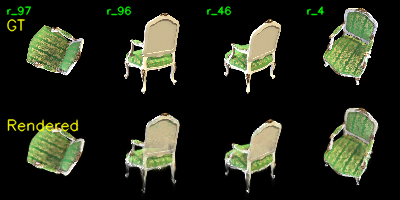
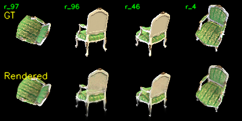
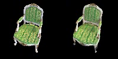
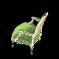
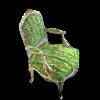
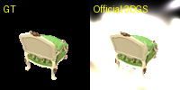
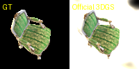

# Assignment 4 - Simplified 3D Gaussian Splatting

## 1. 实验目标

本次作业实现一个简化版 3D Gaussian Splatting pipeline。整体流程包括：

1. 使用 COLMAP 从多视角图像中恢复相机内外参，并得到稀疏三维点云。
2. 将 COLMAP 点云初始化为一组三维 Gaussian。
3. 在 PyTorch 中实现三维 Gaussian 的投影、二维 Gaussian 计算和 alpha blending 渲染。
4. 训练 Gaussian 参数，使渲染结果逼近输入视角图像。

本报告完成 Task 1、Task 2 和 Task 3 的实验记录与分析。

## 2. 数据与环境

本实验选择 `chair` 场景进行重建，输入数据位于：

```text
data/chair/images/
```

该目录包含 100 张多视角渲染图像。原始图像分辨率为 `800 x 800`。在训练简化版 3DGS 时，`ColmapDataset` 默认使用 `downsample_factor=8`，因此训练和渲染时的图像尺寸为 `100 x 100`，可以显著降低纯 PyTorch rasterization 的显存和时间开销。

## 3. Task 1: Structure-from-Motion with COLMAP

### 3.1 运行命令

首先使用 COLMAP 对 `chair` 场景进行特征提取、特征匹配、稀疏重建，并将二进制模型转换为文本格式：

```bash
python mvs_with_colmap.py --data_dir data/chair
```

随后将恢复出的三维点重新投影到每个训练视角上，用于检查相机参数和点云结果：

```bash
python debug_mvs_by_projecting_pts.py --data_dir data/chair
```

### 3.2 COLMAP 输出

COLMAP 输出目录为：

```text
data/chair/sparse/0/
data/chair/sparse/0_text/
```

其中 `0_text` 目录包含后续训练读取的文本模型：

```text
data/chair/sparse/0_text/cameras.txt
data/chair/sparse/0_text/images.txt
data/chair/sparse/0_text/points3D.txt
```

本次恢复结果统计如下：

| 项目 | 数值 |
| --- | ---: |
| 输入图像数量 | 100 |
| 成功注册图像数量 | 100 |
| 相机模型 | PINHOLE |
| 相机数量 | 1 |
| 图像分辨率 | 800 x 800 |
| 稀疏三维点数量 | 13641 |

恢复出的共享相机内参为：

```text
fx = 1112.6587
fy = 1113.0033
cx = 400.0000
cy = 400.0000
```

### 3.3 重投影检查

重投影检查结果保存在：

```text
data/chair/projections/
```

每张图由左右两部分组成：左侧为原始输入图像，右侧为将 COLMAP 稀疏点云投影回对应视角后的结果。

示例结果如下：




从可视化结果可以看到，重投影点大体覆盖了椅子的轮廓、靠背、坐垫和腿部等主要结构区域，说明 COLMAP 恢复的相机位姿和内参是可用的。同时，点云投影仍然明显稀疏，许多表面区域没有连续覆盖。这正是 Task 2 中将每个稀疏点扩展为三维 Gaussian 的动机：通过 Gaussian 的空间尺度、旋转、颜色和透明度参数，用连续的可微渲染表示来覆盖稀疏点附近的局部空间。

## 4. Task 2: Simplified 3D Gaussian Splatting

### 4.1 Gaussian 参数化

每个 Gaussian 包含以下可优化参数：

| 参数 | 含义 | 初始化方式 |
| --- | --- | --- |
| position | 三维中心位置 | COLMAP 稀疏点坐标 |
| rotation | 三维旋转 | 单位四元数 |
| scale | 三维尺度 | 基于局部 KNN 距离初始化 |
| opacity | 不透明度 | logit 空间初始化为较高不透明度 |
| color | RGB 颜色 | COLMAP 点云颜色 |

颜色和不透明度在优化变量中使用 logit 表示，forward 时通过 sigmoid 映射到 `[0, 1]`。scale 在优化变量中使用 log-space 表示，forward 时通过指数函数变为正数。

### 4.2 三维协方差矩阵

在 `gaussian_model.py` 中实现三维 Gaussian 协方差矩阵。设旋转矩阵为 `R`，尺度矩阵为：

```math
S = diag(s_x, s_y, s_z)
```

则三维协方差为：

```math
\Sigma = R S S^T R^T
```

对应实现为：

```python
R = self._compute_rotation_matrices()
scales = torch.exp(self.scales)
S = torch.diag_embed(scales)
L = torch.bmm(R, S)
Covs3d = torch.bmm(L, L.transpose(1, 2))
```

这种写法保证了协方差矩阵是半正定的，同时允许优化尺度和旋转来改变 Gaussian 的空间覆盖形状。

### 4.3 三维 Gaussian 投影到二维图像平面

在 `gaussian_renderer.py` 中实现三维 Gaussian 到二维 Gaussian 的投影。首先将世界坐标点变换到相机坐标：

```math
x_c = R x_w + t
```

然后使用相机内参进行透视投影：

```math
u = f_x x / z + c_x,\quad v = f_y y / z + c_y
```

为了投影协方差，需要计算透视投影对相机坐标的 Jacobian：

```math
J =
\begin{bmatrix}
f_x / z & 0 & -f_x x / z^2 \\
0 & f_y / z & -f_y y / z^2
\end{bmatrix}
```

世界坐标下的三维协方差先旋转到相机坐标：

```math
\Sigma_c = R \Sigma_w R^T
```

再投影为二维协方差：

```math
\Sigma' = J \Sigma_c J^T
```

该部分实现后，每个三维 Gaussian 都对应一个二维图像平面上的中心 `means2D`、协方差 `covs2D` 和深度 `depths`。

### 4.4 二维 Gaussian 取值

对每个像素位置 `x`，二维 Gaussian 的响应值为：

```math
f(x) =
\frac{1}{2\pi \sqrt{|\Sigma|}}
\exp\left(
-\frac{1}{2}(x-\mu)^T \Sigma^{-1}(x-\mu)
\right)
```

实现中对二维协方差矩阵的对角线加入 `eps` 以增强数值稳定性，并对 determinant 进行 clamp，避免矩阵接近奇异时出现除零或 NaN。

```python
eps = 1e-4
covs2D = covs2D + eps * torch.eye(2, device=covs2D.device).unsqueeze(0)
det = torch.linalg.det(covs2D).clamp(min=eps)
inv_covs = torch.linalg.inv(covs2D)
exponent = -0.5 * torch.einsum('nhwi,nij,nhwj->nhw', dx, inv_covs, dx)
norm = 1.0 / (2.0 * np.pi * torch.sqrt(det))
gaussian = norm.view(N, 1, 1) * torch.exp(exponent.clamp(max=0.0))
```

### 4.5 Alpha Blending 渲染

渲染时首先按深度对 Gaussian 排序。对于每个 Gaussian，其 alpha 值由 opacity 与二维 Gaussian 响应相乘得到：

```math
\alpha_i(x) = o_i f_i(x)
```

前方 Gaussian 的累积透射率为：

```math
T_i(x) = \prod_{j<i}(1-\alpha_j(x))
```

最终颜色为：

```math
C(x) = \sum_i T_i(x)\alpha_i(x)c_i
```

代码中使用 `torch.cumprod` 计算每个 Gaussian 之前的透射率：

```python
alphas = alphas.clamp(min=0.0, max=0.999)
transmittance = torch.cumprod(
    torch.cat([
        torch.ones((1, self.H, self.W), device=alphas.device, dtype=alphas.dtype),
        1.0 - alphas + 1e-10,
    ], dim=0),
    dim=0
)[:-1]
weights = alphas * transmittance
rendered = (weights.unsqueeze(-1) * colors).sum(dim=0)
```

对 `alphas` 进行上界 clamp 可以避免某些像素处 alpha 接近 1 后导致后续透射率完全为 0，从而提升训练过程的数值稳定性。

### 4.6 训练命令

使用 COLMAP 输出的 `data/chair/sparse/0_text` 和原始图像训练简化版 3DGS：

```bash
python train.py \
  --colmap_dir data/chair \
  --checkpoint_dir data/chair/checkpoints \
  --num_epochs 201 \
  --debug_every 5 \
  --debug_samples 4 \
  --device cuda
```

训练过程中会定期保存 checkpoint 和可视化对比图：

```text
data/chair/checkpoints/checkpoint_*.pt
data/chair/checkpoints/debug_images/epoch_*.png
data/chair/checkpoints/debug_rendering.mp4
```

训练完成后，可以使用如下命令渲染水平环绕视频：

```bash
python render_3dgs_mv.py \
  --colmap_dir data/chair \
  --checkpoint data/chair/checkpoints/checkpoint_000200.pt \
  --output data/chair/render_mv.mp4 \
  --num_frames 240 \
  --fps 30 \
  --device cuda
```

### 4.7 训练输出

训练完成后，输出目录为：

```text
data/chair/checkpoints/
```

本次训练共保存了 11 个 checkpoint：

```text
checkpoint_000000.pt
checkpoint_000020.pt
...
checkpoint_000200.pt
```

最终 checkpoint 为 `checkpoint_000200.pt`，其中模型参数规模如下：

| 参数 | 形状 |
| --- | --- |
| positions | 13641 x 3 |
| colors | 13641 x 3 |
| opacities | 13641 x 1 |
| scales | 13641 x 3 |
| rotations | 13641 x 4 |

这说明本实验将 COLMAP 恢复出的 13641 个稀疏点全部初始化为可优化的 3D Gaussian，没有进行自适应 densification 或 pruning。

训练过程中每 5 个 epoch 保存一次 debug 图，共保存 41 张：

```text
data/chair/checkpoints/debug_images/epoch_0000.png
...
data/chair/checkpoints/debug_images/epoch_0200.png
```

其中每张 debug 图的上方为 GT，下方为简化版 3DGS 的渲染结果。

### 4.8 训练过程可视化

epoch 0 的结果已经可以看出椅子的大致形状，但图像非常模糊，边界和纹理都没有准确对齐：



训练到 epoch 100 后，椅子的整体轮廓、绿色坐垫纹理和靠背颜色已经明显接近 GT：



epoch 200 的结果与 epoch 100 相比变化较小，说明在当前简化模型和训练设置下已经基本收敛：



从结果可以看到，简化版 3DGS 能够较好地恢复椅子的主体颜色、姿态和大尺度形状。主要不足集中在细结构和边缘区域：椅子腿、边缘轮廓附近仍有轻微拖影或漂浮点，局部纹理也比 GT 更模糊。这与简化实现的限制一致：当前实现没有 tile-based rasterizer、adaptive densification、visibility-aware pruning 或 spherical harmonics 颜色表达，因此对细节和遮挡边界的建模能力有限。

### 4.9 视频渲染结果

训练脚本自动生成了沿训练相机路径的对比视频：

```text
data/chair/checkpoints/debug_rendering.mp4
```

该视频共 100 帧，帧率为 3 FPS，分辨率为 `200 x 100`。每一帧左侧是 GT，右侧是当前训练出的 Gaussian 模型渲染结果。末尾帧示例如下：



另外，使用 `render_3dgs_mv.py` 生成了水平环绕新视角视频：

```text
data/chair/render_mv.mp4
```

该视频共 240 帧，帧率为 30 FPS，分辨率为 `100 x 100`。示例帧如下：





环绕视频说明优化后的 Gaussian 不只是记住单张视角，而是形成了一个可以从连续视角渲染的三维表示。由于没有执行 densification，新视角下局部细节仍不够稳定，椅子腿和轮廓处更容易出现半透明拖影；但主体结构在环绕视角中基本保持一致。

## 5. 小结

Task 1 中，COLMAP 成功从 `chair` 场景的 100 张输入图像中恢复了 100 个相机视角和 13641 个稀疏三维点。重投影结果显示，稀疏点基本落在目标物体的主要结构上，说明相机参数和点云初始化质量可用于后续 3DGS 训练。

Task 2 中，已完成简化版 3DGS 的核心 PyTorch 实现，包括三维协方差构造、三维到二维 Gaussian 投影、二维 Gaussian 响应计算和基于 alpha blending 的可微渲染。训练 201 个 epoch 后，模型能够较好地重建椅子的主要形状和颜色，并能生成连续新视角视频。该实现虽然没有官方 3DGS 中的 tile-based CUDA rasterizer、adaptive densification 和更复杂的颜色建模，因此在细结构和边缘区域仍有拖影和模糊，但已经覆盖了 3DGS 从点云初始化到可微渲染优化的核心思想。

## 6. Task 3: 与官方 3DGS 实现对比

### 6.1 官方实现运行设置

为了与本作业的简化 PyTorch 版本进行对比，我使用相同的 `chair` 数据运行官方 3DGS 实现。输入数据为同一份 COLMAP 输出：

```text
data/chair/images/
data/chair/sparse/0/
```

官方实现的训练命令如下：

```bash
python train.py \
  -s ../Assignment_04_3DGS/data/chair \
  -m ../Assignment_04_3DGS/data/chair/official_3dgs \
  -r 8 \
  --eval \
  --iterations 7000 \
  --test_iterations 7000 \
  --save_iterations 7000
```

其中 `-r 8` 与简化版中的 `downsample_factor=8` 对齐，训练和评估图像分辨率均为 `100 x 100`。本次没有使用 `-w`，因为该数据集的 GT 图像是黑色背景。

训练完成后运行：

```bash
python render.py -m ../Assignment_04_3DGS/data/chair/official_3dgs
python metrics.py -m ../Assignment_04_3DGS/data/chair/official_3dgs
```

官方实现使用 `--eval` 后，将 100 个视角划分为 87 个 train view 和 13 个 test view。

### 6.2 官方输出统计

官方训练输出目录为：

```text
data/chair/official_3dgs/
```

主要输出文件包括：

```text
data/chair/official_3dgs/point_cloud/iteration_7000/point_cloud.ply
data/chair/official_3dgs/test/ours_7000/renders/
data/chair/official_3dgs/test/ours_7000/gt/
data/chair/official_3dgs/results.json
data/chair/official_3dgs/per_view.json
```

官方初始点云 `input.ply` 中有 13641 个点，与 COLMAP 稀疏点数量一致。训练到 7000 iterations 后，`point_cloud.ply` 中包含 35784 个 Gaussian，说明官方实现执行了 densification，将点数增加到初始点云的约 2.62 倍。

| 项目 | 简化 PyTorch 版本 | 官方 3DGS 版本 |
| --- | ---: | ---: |
| 初始点 / Gaussian 数量 | 13641 | 13641 |
| 最终 Gaussian 数量 | 13641 | 35784 |
| 图像分辨率 | 100 x 100 | 100 x 100 |
| 训练视角 | 100 | 87 |
| 测试视角 | 未单独划分 | 13 |

### 6.3 渲染质量对比

官方 `metrics.py` 在 13 个 test view 上得到的结果如下：

| Method | Iterations | SSIM | PSNR | LPIPS |
| --- | ---: | ---: | ---: | ---: |
| Official 3DGS | 7000 | 0.1815 | 2.3807 | 0.4471 |

该数值明显偏低。检查官方渲染结果后可以看到，GT 图像是黑色背景，而官方 render 中仍存在大面积白色背景和边缘光晕。示例如下，左侧为 GT，右侧为官方 3DGS 渲染：





因此，本次官方指标不能完全代表官方 3DGS 在该数据上的理论上限，而更可能反映了官方数据读取、PNG alpha/背景合成或本数据集黑底渲染方式之间的不匹配。即使 `cfg_args` 中记录 `white_background=False`，输出中仍出现白色背景区域，导致 PSNR 和 SSIM 被背景差异严重拉低。

从物体主体看，官方渲染出的椅子姿态和颜色大致正确，但背景错误占据了大量像素，直接影响全图指标。相比之下，简化 PyTorch 版本在训练视角 debug 图中能够保持黑色背景，并较好恢复椅子主体，但边缘和椅子腿仍有拖影。需要注意的是，简化版 debug 图主要是训练视角可视化，而官方指标是在 test view 上计算，因此二者不是严格同一评估协议；这里主要用于分析两种实现的行为差异。

### 6.4 训练速度对比

官方 3DGS 训练日志显示，7000 iterations 的总 wall-clock 时间为：

```text
Elapsed (wall clock) time: 1:07.26
```

训练后期速度约为 `110-130 it/s`，最终日志中显示：

```text
7000/7000 [01:00, 116.20it/s]
```

官方实现速度明显受益于 CUDA rasterizer、tile-based rendering 和针对 Gaussian splatting 的工程优化。简化 PyTorch 版本则直接在 Python/PyTorch 中对所有 Gaussian 和所有像素进行矩阵运算和 alpha blending，复杂度接近 `O(NHW)`。在本实验中 `N=13641`，`H=W=100`，每个视角都需要处理大量 Gaussian-pixel 组合，因此训练效率远低于官方实现。

本次回传文件中没有包含简化版训练的 wall-clock 日志，因此这里不报告严格的数值速度比。后续若需要精确对比，可以用如下命令重新记录简化版训练时间：

```bash
/usr/bin/time -v python train.py \
  --colmap_dir data/chair \
  --checkpoint_dir data/chair/checkpoints \
  --num_epochs 201 \
  --debug_every 5 \
  --debug_samples 4 \
  --device cuda
```

### 6.5 显存与内存占用对比

官方训练日志中记录的 CPU 最大常驻内存为：

```text
Maximum resident set size: 2403328 kbytes
```

约为 2.29 GB。由于本次未同步独立的 `nvidia-smi` 记录，无法从回传文件中得到官方训练的 GPU 显存峰值。同样，简化 PyTorch 版本也没有回传显存日志，因此这里不虚构显存数值。

从实现机制上看，两者的显存使用方式不同：

| 方面 | 简化 PyTorch 版本 | 官方 3DGS 版本 |
| --- | --- | --- |
| Rasterization | 直接构造 Gaussian-pixel 张量 | CUDA tile-based rasterizer |
| Gaussian 数量 | 固定 13641 | densification 后 35784 |
| 显存风险 | 大量 `(N,H,W)` 中间张量 | 更多 Gaussian 参数，但渲染器更节省中间张量 |
| 工程效率 | 易懂但低效 | 高效但实现复杂 |

简化版虽然 Gaussian 数量较少，但需要显式计算每个 Gaussian 在整张图像上的响应，容易产生较大的中间张量。官方版 Gaussian 数量更多，但 tile-based rasterizer 只处理与 tile 相关的 Gaussian，并使用 CUDA kernel 完成排序、裁剪和混合，因此在相同渲染分辨率下通常更高效。

### 6.6 差异来源分析

官方 3DGS 与本作业简化版的主要差异包括：

1. **Rasterization 实现不同**  
   简化版使用纯 PyTorch 实现投影、二维 Gaussian 计算和 alpha blending，适合学习公式和 pipeline。官方版使用 CUDA rasterizer 和 tile-based splatting，能够高效处理大量 Gaussian。

2. **Gaussian 数量更新机制不同**  
   简化版不做 adaptive densification，最终 Gaussian 数量保持 13641。官方版训练到 7000 iterations 后 Gaussian 数量增加到 35784，说明它会根据梯度和可见性动态增密，从而更好覆盖细节区域。

3. **颜色表达能力不同**  
   简化版每个 Gaussian 只有一个 RGB 颜色。官方版使用 spherical harmonics 表示视角相关颜色，理论上能更好建模反光、视角变化和细节纹理。

4. **背景和数据格式适配问题**  
   本次官方实验中，虽然设置为黑背景训练，但输出 render 中仍出现白色背景区域。这导致官方 metrics 异常低。该问题可能与数据集 PNG alpha、COLMAP 数据格式或官方代码的数据读取/背景合成逻辑有关。后续若要获得更公平的官方质量对比，应进一步检查输入 PNG 的 alpha 通道处理方式，或将数据预处理为官方 3DGS 更标准的黑底 RGB 图像。

### 6.7 Task 3 小结

本次官方 3DGS 实验成功完成了 7000 iterations 训练、渲染和 metrics 计算。官方实现训练速度非常快，约 1 分 07 秒完成 7000 iterations，并通过 densification 将 Gaussian 数量从 13641 增加到 35784。质量指标方面，官方 test view 的 PSNR/SSIM/LPIPS 分别为 2.3807、0.1815 和 0.4471，但从可视化结果看，该低指标主要由黑底 GT 与白色背景 render 的不一致造成。因此，本文将该结果作为一次官方实现运行与数据适配分析，而不将其解释为官方 3DGS 方法本身的质量上限。
